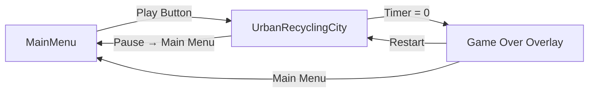
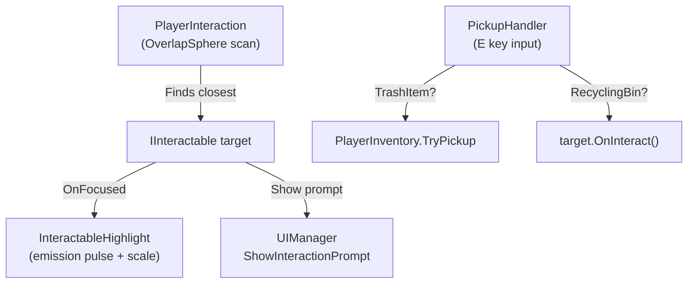
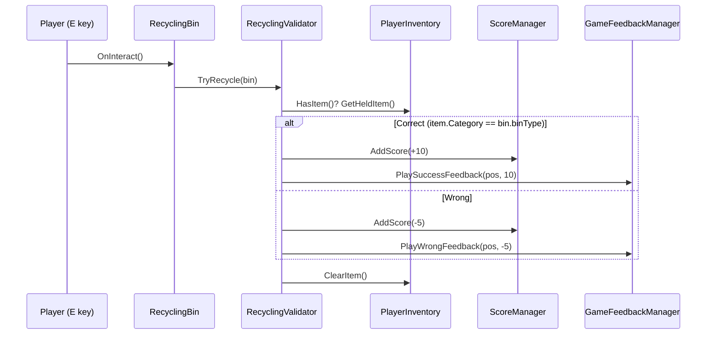

# 🌿 Smart Recycling Adventure — Full Walkthrough & Documentation

---

## 1. Project Overview

| Field | Value |
|---|---|
| **Project Name** | Smart Recycling Adventure (internal: *Eco-Clean*) |
| **Engine** | Unity 6 (URP 17.0.4) |
| **Render Pipeline** | Universal Render Pipeline (URP) |
| **Platform** | Windows (Standalone) |
| **Genre** | 3D Educational / Environmental Awareness |
| **Player Controller** | Unity StarterAssets — Third Person Controller |
| **Input System** | Unity New Input System 1.14.2 |
| **Camera** | Cinemachine 3.1.6 |

### Game Concept

The player controls a third-person character exploring an **urban city environment**. Trash items (plastic bottles, paper, glass jars, metal cans) are scattered around the map. The player must:

1. **Walk up** to a trash item and **press E** to pick it up (one item at a time).
2. **Carry** it to the correct color-coded **recycling bin**.
3. **Press E** at the bin to deposit the item.
4. Earn **+10 points** for correct sorting, lose **-5 points** for wrong sorting.
5. Complete as many correct recycling actions as possible before the **2 min 30 sec timer** expires.

When the timer hits zero, the **Game Over** screen shows the final score and saves it to a **local leaderboard** (top 5, persisted via PlayerPrefs).

---

## 2. Scenes

| # | Scene Name | File | Purpose |
|---|---|---|---|
| 1 | **MainMenu** | `Assets/Scenes/MainMenu.unity` | Title screen with Play, Leaderboard, Quit buttons and best-score display |
| 2 | **UrbanRecyclingCity** | `Assets/Scenes/UrbanRecyclingCity.unity` | Main gameplay scene — the 3D city with bins, trash, HUD, timer, pause menu |
| 3 | MainScene | `Assets/Scenes/MainScene.unity` | Legacy/test scene (not used in final flow) |

### Scene Flow



All scene transitions use the **SceneTransitionManager** which creates a runtime full-screen black fade overlay (sort order 9999) and persists via `DontDestroyOnLoad`.

---

## 3. Folder Structure

```
Assets/
├── Art/                    # 3D models, environment art
├── Audio/                  # gameplay.mp3, main-menu.mp3
├── Cans pack/              # Metal can 3D models
├── Editor/                 # 14 editor utility scripts (UI builders, trash distributor, etc.)
├── GUIPackCartoon/         # Cartoon UI sprite kit
├── Interface & Item Sounds Lite/  # SFX library (hover, click, pickup, success, wrong)
├── JMO Assets/             # Cartoon FX Remaster (VFX particle prefabs)
├── Materials/              # Shared materials
├── Plugins/                # Third-party plugins
├── Prefabs/
│   └── RecyclingBins/      # BIN_Plastic, BIN_Paper, BIN_Glass, BIN_Metal prefabs
├── Scenes/                 # MainMenu, UrbanRecyclingCity, MainScene
├── Scripts/                # ★ All gameplay code (documented below)
├── StarterAssets/           # Unity ThirdPersonController package
├── Trash/                  # Trash 3D models organized by category
│   ├── Glass/
│   ├── Metal/
│   ├── Paper/
│   └── Plastic/
├── UI/MainMenu/            # Main menu UI assets
├── VFX/                    # Visual effect assets
└── main-menu background-image.png
```

---

## 4. Scripts Architecture

### 4.1 Directory Layout

```
Scripts/
├── TrashItem.cs                # Core trash item component + TrashCategory enum
├── RecyclingBin.cs             # Recycling bin interactable endpoint
├── Interaction/
│   ├── IInteractable.cs        # Interface for all interactable objects
│   ├── InteractableHighlight.cs # Emission pulse + scale bounce on focus
│   └── PlayerInteraction.cs    # OverlapSphere detection + target management
├── Inventory/
│   ├── PlayerInventory.cs      # Single-item holding system (singleton)
│   ├── PickupHandler.cs        # E-key input → pickup bridge
│   └── InventoryUIController.cs # Animated inventory HUD panel
├── Recycling/
│   ├── RecyclingValidator.cs   # Category match validation + scoring
│   ├── RecyclingFeedback.cs    # Audio + particle feedback router
│   ├── ScoreManager.cs         # Score state + events (singleton)
│   └── ScoreUIAnimator.cs      # Pop + color flash on score change
├── Timer/
│   └── TimerManager.cs         # Countdown timer + warning state + game end
├── MainMenu/
│   ├── MainMenuManager.cs      # Button wiring, leaderboard panel, fade-in
│   ├── LeaderboardManager.cs   # Top-5 persistent scores (PlayerPrefs)
│   ├── HighScoreDisplay.cs     # Best score label on main menu
│   ├── MenuAudioManager.cs     # Menu BGM + hover/click SFX
│   ├── MenuButtonAnimator.cs   # Cartoon hover/press scale animations
│   └── SceneTransitionManager.cs # Fade overlay + DontDestroyOnLoad
├── GameOver/
│   └── GameOverManager.cs      # Game-over trigger, score save, restart/menu
├── Pause/
│   └── PauseMenuManager.cs     # ESC toggle, Time.timeScale freeze, cursor unlock
├── Systems/
│   ├── GameFeedbackManager.cs  # Central VFX + audio + floating text orchestrator
│   ├── FloatingFeedbackText.cs # Runtime world-space TMP popup (billboard)
│   ├── BinLabelVisibility.cs   # Camera-facing label toggle for bins
│   └── GameplayMusicManager.cs # Gameplay BGM with fade-in/out
└── UI/
    ├── UIManager.cs            # Central HUD controller (score, timer, inventory, prompts)
    └── InteractionPromptUI.cs  # TMP-based interaction prompt with fade
```

### 4.2 Singleton Registry

All major managers use the singleton pattern (`Instance` property):

| Singleton | Attached To |
|---|---|
| `PlayerInventory` | PlayerCharacter |
| `RecyclingValidator` | PlayerCharacter |
| `RecyclingFeedback` | PlayerCharacter |
| `GameFeedbackManager` | PlayerCharacter |
| `ScoreManager` | GameManagers object |
| `TimerManager` | GameManagers object |
| `UIManager` | GameCanvas |
| `PauseMenuManager` | PauseMenu object |
| `SceneTransitionManager` | Persists (DontDestroyOnLoad) |
| `LeaderboardManager` | MainMenu scene |
| `MenuAudioManager` | MainMenu scene |
| `GameplayMusicManager` | Gameplay scene |

---

## 5. Core Systems — Deep Dive

### 5.1 Interaction System



**`PlayerInteraction`** uses `Physics.OverlapSphereNonAlloc` with:
- **Layer mask** filtering (`Interactable` layer)
- **Pre-allocated buffer** (20 colliders, zero GC)
- **Throttled scanning** (every 0.1s configurable)
- **Hysteresis buffer** (0.8m extra range before losing target — prevents flickering)
- **Current-target bias** (−0.3m distance bias to prevent rapid switching)

**`IInteractable`** interface defines:
- `InteractionPrompt` — text shown in HUD
- `CanInteract` — whether interaction is possible
- `OnInteract()` — called on E press
- `OnFocused()` / `OnUnfocused()` — per-frame visual feedback hooks

### 5.2 Trash Items

**`TrashCategory`** enum: `Plastic`, `Paper`, `Glass`, `Metal`

Each trash prefab has a **`TrashItem`** component with:
- `Category` — which bin it belongs to
- `DisplayName` — shown to player
- `PointValue` — default 10 points
- `IsInteractable` / `IsCollected` — state flags

Color mapping:
| Category | Color | Hex Approx |
|---|---|---|
| Plastic | Yellow | `(1, 0.84, 0)` |
| Paper | Blue | `(0.2, 0.6, 1)` |
| Glass | Green | `(0.2, 0.8, 0.4)` |
| Metal | Silver/Gray | `(0.75, 0.75, 0.75)` |

### 5.3 Inventory System

**Single-item rule:** The player can hold only **one** trash item at a time.

**Pickup flow:**
1. `PickupHandler.Update()` detects **E key** press
2. Checks `PlayerInteraction.HasTarget` and cooldown (0.25s anti-spam)
3. If target is `TrashItem` → calls `PlayerInventory.TryPickup(item)`
4. If target is `RecyclingBin` → calls `target.OnInteract()` directly
5. On successful pickup: item is deactivated (not destroyed), UI updates, VFX + SFX play
6. On blocked (already holding): "Already holding an item!" feedback + red shake pulse on inventory UI

**Events fired:** `OnItemPickedUp(TrashItem)`, `OnItemReleased(TrashItem)`

### 5.4 Recycling Validation



**Scoring rules:**
- ✅ Correct recycling: **+10 points**
- ❌ Wrong recycling: **-5 points**
- Score is clamped to minimum **0** (never goes negative)

### 5.5 Timer System

- **Default duration:** 150 seconds (2 min 30 sec)
- **Warning threshold:** 30 seconds remaining
- **Warning effects:** Timer text turns **red** + pulsing scale animation (1.0–1.25×)
- **On time up:**
  1. Timer stops
  2. `PlayerInteraction` is disabled (no more pickups/recycling)
  3. "TIME UP!" feedback shown
  4. `GameOverManager` detects `TimerManager.IsTimeUp` and triggers game over

### 5.6 Game Over

When the timer reaches zero:
1. `Time.timeScale = 0f` — freezes all gameplay
2. `PlayerInput` disabled — disconnects all movement/camera
3. Cursor unlocked and visible
4. Score saved to leaderboard via `LeaderboardManager.SaveScore()`
5. Game Over panel shown with "FINAL SCORE\n{score}"
6. **Restart** button reloads current scene (resets timeScale first)
7. **Main Menu** button returns to MainMenu scene

### 5.7 Pause Menu

- **Toggle:** `Escape` key or HUD pause button (top-right)
- **Pause:** `Time.timeScale = 0`, cursor unlocked, panel fades in (0.15s using `unscaledDeltaTime`)
- **Resume:** `Time.timeScale = 1`, cursor re-locked, panel fades out
- **Main Menu:** Resets timeScale, loads MainMenu scene
- **Audio:** Hover/click sounds on all buttons via EventTrigger

### 5.8 Feedback & Polish System

**`GameFeedbackManager`** is the central orchestrator for all gameplay feedback:

| Action | Audio | VFX | Floating Text | HUD |
|---|---|---|---|---|
| **Pickup** | Pop/click SFX | Sparkle poof (CFXR) | — | "Picked up: {name}" |
| **Correct Recycle** | Success chime | Green sparkle (CFXR) | "+10 Correct/Nice/Great/Perfect!" | "+10 Correct Recycling!" |
| **Wrong Recycle** | Warning buzzer | Red burst (CFXR) | "Wrong Bin! -5" | "Wrong Bin! -5" |
| **No Item** | — | — | — | "No Item" (gray) |

**`FloatingFeedbackText`** creates runtime world-space `TextMeshPro` popups that:
- Billboard toward camera
- Pop-in with overshoot scale
- Float upward with ease-out
- Fade out in final 30% of lifetime
- Self-destroy after 1.2 seconds

**`ScoreUIAnimator`** provides event-driven score text animation:
- Scale pop (1.25×) with elastic bounce settle
- Green flash for positive changes, red flash for negative
- Zero per-frame overhead (only triggers on score events)

### 5.9 Bin Label Visibility

**`BinLabelVisibility`** ensures only the camera-facing label set (front/back) is visible:
- Uses dot-product comparison with hysteresis (0.06) to prevent flicker
- Throttled updates (every 0.1s)
- Distance culling at 30m (hides all labels beyond range)
- Handles both FrontLabelPlate/Text and BackLabelPlate/Text children

---

## 6. Main Menu System

### Features
- **Play** — loads UrbanRecyclingCity via SceneTransitionManager
- **Leaderboard** — popup panel showing top 5 scores with animated open/close
- **Quit** — exits application
- **Best Score** — always-visible panel showing highest recorded score
- **BGM** — looping menu music with configurable volume
- **Button animations** — cartoon-style hover scale (1.08×), press shrink (0.95×), smooth lerp
- **Hover/click sounds** — via MenuAudioManager singleton
- **Fade-in** — CanvasGroup alpha 0→1 over 0.8s on scene start

### Leaderboard Persistence

`LeaderboardManager` stores top 5 scores in `PlayerPrefs`:
- Keys: `LeaderboardScore_0` through `LeaderboardScore_4` (highest first)
- Insert-and-sort algorithm maintains descending order
- Static `SaveScore()` works even without an active instance (fallback to direct PlayerPrefs)
- Static `GetBestScoreStatic()` for main menu display

---

## 7. Audio Architecture

| Context | Manager | BGM | SFX |
|---|---|---|---|
| Main Menu | `MenuAudioManager` | `main-menu.mp3` (looped) | Hover/click sounds |
| Gameplay | `GameplayMusicManager` | `gameplay.mp3` (looped, fade-in 2s) | — |
| Gameplay SFX | `GameFeedbackManager` | — | Pickup, success, wrong clips |
| Recycling | `RecyclingFeedback` | — | Success/wrong clips (fallback) |
| Timer | `TimerManager` | — | Time-up sound |

All gameplay audio uses `spatialBlend = 0` (2D) for responsive, UI-quality feel.

---

## 8. Player Controller

Uses **Unity StarterAssets Third Person Controller** with:
- **New Input System** for movement (WASD/gamepad)
- **Cinemachine** third-person follow camera
- Cursor locked during gameplay, unlocked for menus/game-over
- `StarterAssetsInputs.cursorLocked` force-disabled on game over

---

## 9. Recycling Bins

Four bin prefabs in `Assets/Prefabs/RecyclingBins/`:

| Prefab | Category | Label |
|---|---|---|
| `BIN_Plastic.prefab` | Plastic | Yellow label |
| `BIN_Paper.prefab` | Paper | Blue label |
| `BIN_Glass.prefab` | Glass | Green label |
| `BIN_Metal.prefab` | Metal | Gray label |

Each bin has:
- `RecyclingBin` component (binType, dropPoint, IInteractable)
- `InteractableHighlight` for focus glow
- `BinLabelVisibility` for camera-facing labels
- Front + back label plates/text children
- Collider on `Interactable` layer

---

## 10. UI System

### HUD Elements (managed by `UIManager`)

| Element | Type | Shows |
|---|---|---|
| Score | `Text` | Current score number |
| Timer | `Text` | MM:SS countdown |
| Inventory | `Image` + `Text` | Held item icon + name |
| Interaction Prompt | `CanvasGroup` + `Text` | "Press E to Pick Up" / "Press E to Recycle" |
| Feedback | `CanvasGroup` + `Text` | Temporary colored message with pop animation |

### Inventory UI (`InventoryUIController`)
- Category-specific icons (Plastic/Paper/Glass/Metal sprites)
- Color-coded accent strip matching trash category
- Animated transitions: pop on pickup, shrink on release
- Red shake pulse when pickup is blocked

---

## 11. Editor Utilities

| Script | Menu/Purpose |
|---|---|
| `TrashDistributor.cs` | Distributes trash prefabs across the city map |
| `TrashScaleFixer.cs` | Normalizes trash item scales |
| `TrashScaleNormalizer.cs` | Advanced scale normalization |
| `BinBackLabelCreator.cs` | Creates back-facing labels for bins |
| `UICreator.cs` | Creates HUD UI elements |
| `GameplayUIBuilder.cs` | Builds complete gameplay UI canvas |
| `GameOverUIBuilder.cs` | Builds game-over overlay UI |
| `MainMenuBuilder.cs` | Builds main menu UI |
| `MainMenuSetupEditor.cs` | Wires main menu components |
| `PauseMenuSetupEditor.cs` | Creates pause menu UI |
| `GamePolishUtility.cs` | One-click "Apply Gameplay Polish" tool |
| `RecyclingAudioSetup.cs` | Auto-assigns audio clips |
| `BuildSettingsFixer.cs` | Fixes build settings issues |

---

## 12. Third-Party Assets & Packages

| Asset/Package | Usage |
|---|---|
| StarterAssets (ThirdPersonController) | Player movement + camera |
| Cinemachine 3.1.6 | Third-person camera follow |
| Input System 1.14.2 | New Input System for controls |
| TextMeshPro | UI text rendering + floating text |
| Cartoon FX Remaster (JMO Assets) | VFX particle prefabs (pickup sparkle, success/wrong bursts) |
| GUIPackCartoon | Cartoon UI sprite kit for menu buttons |
| Interface & Item Sounds Lite v2 | UI hover/click sounds, gameplay SFX |
| Cans Pack | Metal can 3D models |
| ProBuilder 6.0.9 | Level geometry editing |
| URP 17.0.4 | Rendering pipeline |
| Visual Effect Graph 17.0.4 | Advanced visual effects |
| AI Navigation 2.0.9 | NavMesh (available but not actively used) |

---

## 13. Gameplay Walkthrough (Player Perspective)

### Step 1: Main Menu
- The game opens to the **Main Menu** with an animated fade-in
- Background music plays, buttons have hover/click animations and sounds
- Your **best score** is displayed on screen
- Click **Play** to start → screen fades to black → gameplay loads

### Step 2: Exploring the City
- You spawn as a third-person character in an **urban city**
- The HUD shows: **Score** (top), **Timer** (counting down from 02:30), **Inventory** (empty)
- Use **WASD** to move, **mouse** to look around
- Trash items are scattered all over the map — bottles, papers, cans, jars

### Step 3: Picking Up Trash
- Walk near a trash item → it **glows** (emission highlight + subtle scale bounce)
- An interaction prompt appears: **"Press E to Pick Up"**
- Press **E** → the item disappears from the world with a **sparkle VFX** and **pickup sound**
- Your inventory HUD updates to show the item name and category-colored accent
- You can only hold **one item** — trying to pick up another shows "Already holding an item!"

### Step 4: Recycling
- Find the correct **color-coded bin** (Plastic=Yellow, Paper=Blue, Glass=Green, Metal=Gray)
- Walk near it → prompt shows **"Press E to Recycle"**
- Press **E** to deposit:
  - ✅ **Correct bin:** +10 points, green sparkle VFX, success sound, floating "+10 Correct!" text
  - ❌ **Wrong bin:** -5 points, red burst VFX, buzzer sound, floating "Wrong Bin! -5" text
- The item is consumed and your inventory is cleared — go find the next one!

### Step 5: Time Pressure
- When **30 seconds** remain → timer turns **red** and starts **pulsing**
- When timer hits **00:00**:
  - "TIME UP!" flash on screen
  - All interaction is disabled
  - After a beat, the **Game Over** overlay appears

### Step 6: Game Over
- The overlay shows your **FINAL SCORE** in large text
- Your score is automatically saved to the **leaderboard**
- Two buttons: **Restart** (replay) or **Main Menu** (return to title)

### Step 7: Leaderboard
- Back on the Main Menu, click **Leaderboard** to see your **top 5 all-time scores**
- Scores persist between sessions via PlayerPrefs

### Pause Anytime
- Press **Escape** during gameplay → game freezes, pause menu appears
- Options: **Resume** or **Main Menu**

---

## 14. Key Design Patterns

| Pattern | Where Used |
|---|---|
| **Singleton** | All managers (ScoreManager, TimerManager, UIManager, etc.) |
| **Interface Polymorphism** | `IInteractable` — TrashItem and RecyclingBin share same interaction pipeline |
| **Event-Driven** | `ScoreManager.OnScoreChanged`, `PlayerInventory.OnItemPickedUp/Released` |
| **Chain of Responsibility** | PickupHandler → PlayerInteraction → IInteractable → PlayerInventory/RecyclingValidator |
| **Factory** | `FloatingFeedbackText.Spawn()`, `RecyclingFeedback.SpawnParticleEffect()` — runtime object creation |
| **Facade** | `GameFeedbackManager` — single entry point for all feedback (audio + VFX + UI) |
| **Observer** | `ScoreUIAnimator` subscribes to `ScoreManager.OnScoreChanged` |

---

## 15. Configuration Quick Reference

| Parameter | Default | Location |
|---|---|---|
| Timer duration | 150s (2:30) | `TimerManager.startingTime` |
| Warning threshold | 30s | `TimerManager.warningTimeThreshold` |
| Correct recycle points | +10 | `ScoreManager.CORRECT_RECYCLE_POINTS` |
| Wrong recycle penalty | -5 | `ScoreManager.WRONG_RECYCLE_PENALTY` |
| Interaction range | 3.5m | `PlayerInteraction.interactionRange` |
| Hysteresis buffer | 0.8m | `PlayerInteraction.hysteresisBuffer` |
| Scan interval | 0.1s | `PlayerInteraction.scanInterval` |
| Pickup cooldown | 0.25s | `PickupHandler.pickupCooldown` |
| Pickup key | E | `PickupHandler.pickupKey` |
| Pause key | Escape | `PauseMenuManager.Update()` |
| Leaderboard slots | 5 | `LeaderboardManager.MAX_SCORES` |
| Fade duration | 0.5s | `SceneTransitionManager.fadeDuration` |
| Menu fade-in | 0.8s | `MainMenuManager.fadeInDuration` |
| Music volume (menu) | 0.3 | `MenuAudioManager.musicVolume` |
| Music volume (gameplay) | 0.25 | `GameplayMusicManager.musicVolume` |
| SFX volume | 0.6 | `GameFeedbackManager.sfxVolume` |
